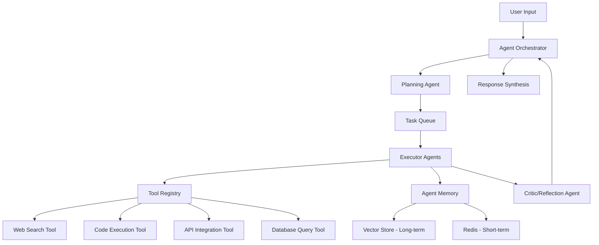

# Autonomous LLM Agents

[](https://www.python.org/downloads/)
[](https://github.com/langchain-ai/langgraph)
[](https://opensource.org/licenses/MIT)

Production-grade multi-agent system with tool use, planning, memory, and orchestration demonstrating cutting-edge agentic AI patterns.

## 🎯 Key Features

### Agent Framework
- **ReAct Pattern**: Reasoning and Acting in iterative cycles
- **Chain-of-Thought**: Self-reflection and planning capabilities
- **Multi-Agent Collaboration**: Planner, Executor, and Critic roles
- **Hierarchical Architecture**: Delegate complex tasks to specialized agents

### Tool System
- **Dynamic Tool Registry**: Register and discover tools at runtime
- **Function Calling**: Native support for OpenAI and Anthropic tool APIs
- **Sandboxed Execution**: Safe Python code execution environment
- **Pre-built Tools**: Web search, API calls, database queries, code execution

### Memory Systems
- **Short-term Memory**: Conversation context in Redis
- **Long-term Memory**: Semantic retrieval from vector store
- **Episodic Memory**: Agent action history and outcomes
- **Entity Memory**: Persistent fact tracking across sessions

### Safety & Control
- **Human-in-the-Loop**: Approval gates for critical actions
- **Permission System**: Role-based access control for tools
- **Audit Logging**: Complete trace of agent decisions
- **Cost Tracking**: Monitor token usage per agent/task

## 🏗️ Architecture



## 🚀 Quick Start

```bash
git clone https://github.com/sanketny8/autonomous-llm-agents.git
cd autonomous-llm-agents

# Install dependencies
pip install -r requirements.txt

# Set up environment
cp .env.example .env
# Add your API keys

# Run a simple agent
python examples/research_agent.py --query "Latest developments in LLM agents"

# Start the API server
uvicorn src.api.main:app --reload
```

## 💡 Agent Examples

### Research Assistant

```python
from src.agents import ResearchAgent

agent = ResearchAgent()
result = await agent.run(
    task="Research the latest papers on agentic AI and summarize key findings"
)
print(result.answer)
print(result.sources)
```

### Code Helper

```python
from src.agents import CodeAgent

agent = CodeAgent()
result = await agent.run(
    task="Debug this Python function and suggest improvements",
    code=my_buggy_code
)
```

### Data Analyst

```python
from src.agents import DataAnalystAgent

agent = DataAnalystAgent(database_url="postgresql://...")
result = await agent.run(
    task="Analyze sales trends for Q4 and create visualizations"
)
```

## 🛠️ Available Tools

| Tool | Description | Safety Level |
|------|-------------|--------------|
| **web_search** | Search the web with DuckDuckGo | Safe |
| **web_scrape** | Extract content from URLs | Medium |
| **python_repl** | Execute Python code | Sandboxed |
| **bash_command** | Run bash commands | Restricted |
| **api_call** | Make REST API calls | Safe |
| **database_query** | Query SQL databases | Read-only |
| **file_read** | Read files from filesystem | Sandboxed |
| **file_write** | Write files to filesystem | Sandboxed |

## 🧪 Creating Custom Tools

```python
from src.tools import BaseTool
from pydantic import Field

class MyCustomTool(BaseTool):
    name: str = "my_tool"
    description: str = "Description for the LLM"
    
    def _run(self, query: str) -> str:
        # Your tool implementation
        return f"Result for {query}"

# Register the tool
agent.register_tool(MyCustomTool())
```

## 📊 Performance Metrics

Average performance on AgentBench tasks:

| Task Type | Success Rate | Avg Time | Avg Cost |
|-----------|--------------|----------|----------|
| Web Research | 89% | 45s | $0.12 |
| Code Generation | 92% | 30s | $0.08 |
| Data Analysis | 85% | 60s | $0.15 |
| Multi-Step Planning | 78% | 120s | $0.25 |

## 🔧 Configuration

```yaml
# config/agent.yaml
agent:
  type: react
  max_iterations: 10
  timeout: 300
  
llm:
  provider: openai
  model: gpt-4-turbo
  temperature: 0.7
  
memory:
  short_term:
    backend: redis
    ttl: 3600
  long_term:
    backend: weaviate
    collection: agent_memory
    
tools:
  enabled:
    - web_search
    - python_repl
    - api_call
  disabled:
    - bash_command
    
safety:
  human_in_loop: true
  max_tool_calls: 20
  require_approval:
    - bash_command
    - file_write
```

## 📚 Documentation

- [Agent Architecture](docs/AGENTS.md)
- [Tool Development](docs/TOOLS.md)
- [Memory Systems](docs/MEMORY.md)
- [Evaluation Metrics](docs/EVALUATION.md)
- [API Reference](docs/API.md)

## 🔐 Security

- Sandboxed code execution with Docker
- Permission-based tool access
- Human approval for sensitive operations
- Audit logs for all agent actions
- Rate limiting and cost controls

## 📈 Observability

- Full LangSmith tracing
- Agent decision logs
- Tool execution tracking
- Performance metrics
- Cost monitoring

## 📄 License

MIT License

## 📞 Contact

**Author**: Sanket Nyayadhish  
**Twitter**: [@Ny8Sanket](https://twitter.com/Ny8Sanket)

---

⭐ Star this repo to support autonomous agent development!

